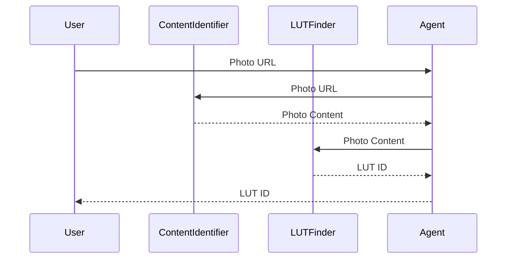
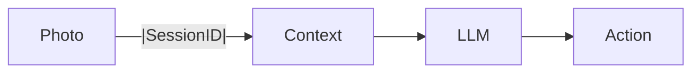

# LutinLens Server

**LutinLens Server** is the backend service for **LutinLens**, an AI-powered camera application built with the **[NVIDIA NeMo Agent Toolkit (NAT)](https://developer.nvidia.com/nemo-agent-toolkit)**.
It provides multiple AI workflows, including LUT recommendations, framing suggestions, and object storage integration.

---

## Table of Contents

* [Introduction](#introduction)
* [Prerequisites](#prerequisites)
* [Installation](#installation)
* [Usage](#usage)
* [Configuration](#configuration)
* [Workflows](#workflows)

  * [lut\_advisor](#lut_advisor)
  * [framing\_advisor](#framing_advisor)
  * [s3](#s3)
* [Deployment](#deployment)
* [License](#license)

---

## Introduction

LutinLens Server leverages **NeMo Agent Toolkit** to deliver three AI workflows:

1. **lut\_advisor** — Suggests a LUT (Look-Up Table) ID based on a photo.
2. **framing\_advisor** — Provides framing/action suggestions based on a session ID and photo input.
3. **s3** — Manages object storage for workflow data.

---

## Prerequisites

Before installation, ensure the following dependencies are available:

* Python **3.9+**
* [NeMo Agent Toolkit](https://developer.nvidia.com/nemo-agent-toolkit)
* Git
* (Optional) S3-compatible object storage service (e.g., AWS S3, MinIO)

---

## Installation

1. Clone this repository:

   ```bash
   git clone https://github.com/m0cal/lutinlens_server.git
   cd lutinlens-server
   ```

2. Install NeMo Agent Toolkit (refer to the [official quick-start guide](https://docs.nvidia.com/nemo/agent-toolkit/latest/quick-start/installing.html)).

3. Install local tools as Python packages:

   ```bash
   pip install ./tools/*
   ```

---

## Usage

To serve a workflow, run:

```bash
nat serve --workflow <workflow_name>
```

Example:

```bash
nat serve --workflow lut_advisor
```

---

## Configuration

* **S3 Storage**
  If you plan to use `s3` for photo storage in `lut_advisor`, configure your storage credentials in:

  ```yaml
  s3/s3.yml
  ```

  Example snippet:

  ```yaml
  endpoint: https://s3.your-storage.com
  access_key: YOUR_ACCESS_KEY
  secret_key: YOUR_SECRET_KEY
  bucket: lutinlens-photos
  ```

---

## Workflows

### lut\_advisor

* **Input:** Photo URL
* **Output:** LUT ID suggestion



---

### framing\_advisor

* **Input:** Session ID + base64-encoded photo
* **Output:** Framing action suggestion



---

### s3

* **Purpose:** Provides object storage for workflow data.
* **Use case:** Store and retrieve photos required by `lut_advisor`.

---

## Deployment

1. Clone this repo and install dependencies.
2. Configure S3 if required.
3. Deploy desired workflows using `nat serve`.

---

## License

[Apache 2.0](./LICENSE)
