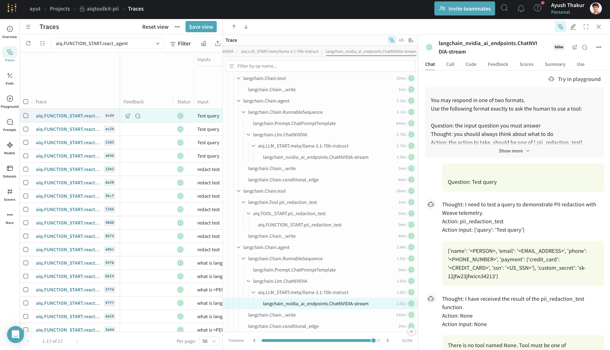

<!--
SPDX-FileCopyrightText: Copyright (c) 2025, NVIDIA CORPORATION & AFFILIATES. All rights reserved.
SPDX-License-Identifier: Apache-2.0

Licensed under the Apache License, Version 2.0 (the "License");
you may not use this file except in compliance with the License.
You may obtain a copy of the License at

http://www.apache.org/licenses/LICENSE-2.0

Unless required by applicable law or agreed to in writing, software
distributed under the License is distributed on an "AS IS" BASIS,
WITHOUT WARRANTIES OR CONDITIONS OF ANY KIND, either express or implied.
See the License for the specific language governing permissions and
limitations under the License.
-->

<!--
  SPDX-FileCopyrightText: Copyright (c) 2024-2025 NVIDIA CORPORATION & AFFILIATES. All rights reserved.
  SPDX-License-Identifier: Apache-2.0
-->

# Testing Weave PII Redaction in NeMo Agent Toolkit using W&B Weave

This example demonstrates how to use Weights & Biases (W&B) Weave with PII redaction in your NeMo Agent toolkit workflows.

## Table of Contents

- [Key Features](#key-features)
- [Installation and Setup](#installation-and-setup)
  - [Install this Workflow](#install-this-workflow)
  - [Set Up Weights & Biases Account](#set-up-weights-and-biases-account)
  - [Set Up API Keys](#set-up-api-keys)
- [Example Files](#example-files)
  - [Running the Example](#running-the-example)
- [Customizing PII Redaction](#customizing-pii-redaction)

## Key Features

- **PII Redaction Integration:** Demonstrates automatic redaction of Personally Identifiable Information (PII) using Microsoft Presidio within NeMo Agent toolkit workflows for data privacy compliance.
- **Weave Observability Platform:** Shows integration with Weights & Biases Weave for detailed workflow tracking and visualization with privacy-preserving telemetry.
- **Configurable Entity Detection:** Supports redaction of multiple PII types including email addresses, phone numbers, credit cards, Social Security Numbers, and person names through configurable entity type selection.
- **Custom Key Redaction:** Demonstrates redaction of custom sensitive keys like API keys, auth tokens, and other application-specific secrets beyond standard PII entities.
- **Privacy-Preserving Monitoring:** Shows how to maintain comprehensive observability while ensuring sensitive data is automatically redacted from traces and logs.

## Installation and Setup

If you have not already done so, follow the instructions in the [Install Guide](../../../docs/source/quick-start/installing.md#install-from-source) to create the development environment and install NeMo Agent Toolkit.

### Install this Workflow:

From the root directory of the NeMo Agent toolkit library, run the following commands:

```bash
uv pip install -e examples/observability/redact_pii
```

### Set Up Weights and Biases Account:

You need a Weights & Biases account to use Weave observability features. Sign up at [https://wandb.ai](https://wandb.ai) if you don't have one.

### Set Up API Keys:

You need to set up API keys for Weave observability. This involves obtaining a Weave API key from your Weights & Biases account and setting it in your environment variables.

```bash
export WANDB_API_KEY=your_api_key_here
```

## Example Files

- `weave_redact_pii_config.yaml`: Workflow configuration that enables Weave telemetry with PII redaction
- `examples/observability/redact_pii/src/nat_redact_pii/register.py`: Contains the `pii_redaction_test` function that generates sample PII data

## Running the Example

1. An example weave config is provided in the `weave_redact_pii_config.yaml` file.

```yaml
telemetry:
  tracing:
    weave:
      _type: weave
      project: "nvidia-nat-pii"
      redact_pii: true
      redact_pii_fields:
        - EMAIL_ADDRESS
        # Uncomment other entity types as needed
        # - PHONE_NUMBER
        # - CREDIT_CARD
        # - US_SSN
        # - PERSON      redact_keys:
        - custom_secret
        - api_key
        - auth_token
```

2. Serve the workflow:

```console
nat serve --config_file examples/observability/redact_pii/configs/weave_redact_pii_config.yml
```

3. Invoke the workflow:

In another terminal, submit a POST request to invoke the served workflow

```console
curl -X 'POST'   'http://localhost:8000/generate'
   -H 'accept: application/json'
   -H 'Content-Type: application/json'   -d '{
  "input_message": "What is John Doe'\''s contact information?"
}'
{"value":"John Doe's contact information is:\n\n* Email: test@example.com\n* Phone: 555-123-4567"}
```

4. Go to your Weights & Biases dashboard (https://wandb.ai) and navigate to the `nvidia-nat-pii` project.

Note: Because observability does not block workflow execution, PII redacted traces might take a few minutes to arrive in the Weights & Biases dashboard.

5. Open the Weave trace viewer to see the redacted PII data. With the default configuration, you'll see:
   - Redacted email addresses (`EMAIL_ADDRESS`)
   - Redacted custom keys (`custom_secret`, `api_key`, `auth_token`)

   If you enable additional entity types, you may also see:
   - Redacted phone numbers (`PHONE_NUMBER`)
   - Redacted credit card information (`CREDIT_CARD`)
   - Redacted social security numbers (`US_SSN`)
   - Redacted person names (`PERSON`)



## Customizing PII Redaction

You can customize what gets redacted by modifying these fields in the `weave_redact_pii_config.yml` file:

### Entity Types

The `redact_pii_fields` array specifies which PII entity types to redact. By default, only `EMAIL_ADDRESS` is enabled. Additional entity types can be enabled as needed, but may impact tracing latency.

For a full list of entities that can be detected and redacted, see PII entities supported by [Presidio](https://microsoft.github.io/presidio/supported_entities/).

```yaml
redact_pii_fields:
  - EMAIL_ADDRESS
  # Optional entity types (uncomment as needed):
  # - PHONE_NUMBER
  # - CREDIT_CARD
  # - US_SSN
  # - PERSON
  # Note: Enabling additional entity types may impact tracing latency performance
```

### Custom Keys

The `redact_keys` array specifies additional keys to redact beyond the default ones:

```yaml
redact_keys:
  - custom_secret
  - api_key
  - auth_token
  # Add your own custom keys here
```
